IB# OYSIPA Investor Tracking System & CRM Fullstack Architecture Document

## 1. Introduction

This document outlines the complete fullstack architecture for the OYSIPA Investor Tracking System & CRM, including backend systems, frontend implementation, and their integration. It serves as the single source of truth for AI-driven development, ensuring consistency across the entire technology stack.

This unified approach combines what would traditionally be separate backend and frontend architecture documents, streamlining the development process for modern fullstack applications where these concerns are increasingly intertwined.

### Starter Template or Existing Project

The PRD does not mention a specific starter template or existing project. This is being treated as a "greenfield" project.

*Rationale:* Starting from a clean slate provides the most flexibility to tailor the architecture and technology stack precisely to the project's requirements without being constrained by pre-existing decisions.

### Change Log

| Date | Version | Description | Author |
| :--- | :--- | :--- | :--- |
| 2025-09-08 | 1.0 | Initial draft | Winston (Architect) |

## 2. High Level Architecture

### Technical Summary

The proposed architecture is a **MERN stack application** featuring a React frontend and a Node.js/Express backend, with MongoDB serving as the database. This stack was chosen for its cohesive use of JavaScript/TypeScript across the entire application, promoting code reuse and development efficiency. The frontend will be deployed globally on **Vercel** for optimal performance and user experience. The backend API will be hosted on **Render**, which provides a simple, scalable platform for containerized services. This architecture is well-suited to the project's goals, offering a rapid development cycle and a robust, modern technology foundation.

### Platform and Infrastructure Choice

As per your direction, we will proceed with the following multi-cloud deployment strategy:

*   **Frontend Platform:** Vercel
*   **Backend Platform:** Render
*   **Database Platform:** MongoDB Atlas
*   **Rationale:** This "best-of-breed" approach leverages the strengths of each platform. Vercel is unparalleled for hosting performant React applications. Render offers a simple, scalable, and cost-effective solution for running backend services. MongoDB Atlas is the industry standard for a fully-managed, cloud-native document database.

### Repository Structure

A monorepo remains the recommended approach to manage the full-stack codebase efficiently.

*   **Structure:** Monorepo
*   **Monorepo Tool:** npm workspaces
*   **Package Organization:** The repository will contain an `apps` directory for the `frontend` (React) and `api` (Express) applications, and a `packages` directory for shared code, such as TypeScript types and validation functions.

### High Level Architecture Diagram

```mermaid
graph TD
    subgraph User
        UserBrowser[👨‍💻 OYSIPA User's Browser]
    end

    subgraph "Vercel Platform"
        Frontend[React Frontend]
    end
    
    subgraph "Render Platform"
        Backend[Node.js/Express API]
    end

    subgraph "MongoDB Atlas"
        Database[(MongoDB Database)]
    end

    UserBrowser -- Loads App --> Frontend;
    Frontend -- API Calls --> Backend;
    Backend -- Queries --> Database;

    style Frontend fill:#22A7F0,stroke:#333,stroke-width:2px
    style Backend fill:#68a063,stroke:#333,stroke-width:2px
    style Database fill:#4DB33D,stroke:#333,stroke-width:2px
```


### Architectural Patterns

These patterns remain highly relevant for the chosen MERN stack:

- **Monolithic Architecture:** The Express.js backend will be a single, unified service.
  - _Rationale:_ Reduces complexity and development time, which is critical for the 4-week MVP timeline.
- **Component-Based UI:** The frontend will be built with reusable React components.
  - _Rationale:_ Standard for modern React development, promoting maintainability and testability.
- **Repository Pattern:** The backend will use a repository layer (e.g., using Mongoose for MongoDB) to abstract database logic from the API controllers.
  - _Rationale:_ Makes the application easier to test and decouples business logic from the data access implementation.
- **API Gateway Pattern (Conceptual):** The main `app.js` or `server.js` file in our Express application will serve as the single entry point for all API traffic, where we will centrally manage middleware for authentication, logging, and error handling.
  - _Rationale:_ Centralizes cross-cutting concerns for better security and manageability.

## 3. Tech Stack

### Technology Stack Table

| Category | Technology | Version | Purpose | Rationale |
| :--- | :--- | :--- | :--- | :--- |
| Frontend Language | TypeScript | ~5.x | Type safety for robust, maintainable code. | Catches errors early, improves developer experience. |
| Frontend Framework | React | ~18.x | Building the user interface with components. | Industry standard for modern, interactive UIs. |
| UI Component Library | Material-UI (MUI) | ~5.x | Pre-built, professional UI components. | Speeds up development and ensures a consistent, high-quality look and feel. |
| State Management | Redux Toolkit | ~2.x | Managing complex application state. | Official, opinionated toolset for efficient Redux development. |
| Backend Language | TypeScript | ~5.x | Type safety for the backend API. | Consistency with frontend, reduces bugs, improves code quality. |
| Backend Framework | Express.js | ~4.x | Building the backend REST API. | Minimal, flexible Node.js framework; the 'E' in MERN. |
| API Style | REST | N/A | Standard for client-server communication. | Well-understood, stateless, and perfect for this application's needs. |
| Database | MongoDB | ~7.x | Storing all application data. | Document-based NoSQL database; the 'M' in MERN. Flexible and scalable. |
| File Storage | Cloudinary | API | Storing uploaded documents (e.g., letters). | Provides a simple API for file storage and delivery with a robust free tier. |
| Authentication | JWT (JSON Web Tokens) | ~9.x | Securely transmitting information between parties. | Standard for stateless authentication in REST APIs. |
| Email Service | Nodemailer | ~6.x | Sending emails from the backend. | Robust and widely-used email library for Node.js. |
| Frontend Testing | Jest & RTL | latest | Unit & component testing for React. | Industry standard for testing React applications. |
| Backend Testing | Jest & Supertest | latest | Unit & API endpoint testing for Express. | Allows for testing API endpoints without a running server. |
| E2E Testing | Cypress | latest | End-to-end testing of user flows. | Powerful tool for testing the application from the user's perspective. |
| Build/Bundler | Vite | ~5.x | Frontend development server and build tool. | Extremely fast developer experience and optimized production builds. |
| CI/CD | Vercel & Render | N/A | Automated builds and deployments. | Both platforms have excellent, integrated CI/CD pipelines. |
| Monitoring | Vercel/Render Built-in | N/A | Basic application health monitoring. | Provides essential metrics out-of-the-box for easy operational oversight. |
| Logging | Pino | ~8.x | High-performance logging for Node.js. | Fast, simple, and produces structured logs suitable for production. |
| CSS Framework | CSS Modules | N/A | Scoped, component-level CSS styling. | Allows writing plain CSS without global scope conflicts; built into Vite. |

## 4. Data Models

### User

**Purpose:** Represents an authenticated user of the system with a specific role.

**TypeScript Interface:**
```typescript
export interface User {
  _id: string;
  name: string;
  email: string;
  role: 'Staff' | 'Portal Administrator' | 'Director-General';
  createdAt: string;
  updatedAt: string;
}
```

**Relationships:**
- A `User` (Staff) can be assigned to many `Investors`.

---

### Investor

**Purpose:** Represents a company or individual investor that OYSIPA is engaged with.

**TypeScript Interface:**
```typescript
export interface Investor {
  _id: string;
  name: string;
  sector: string;
  countryOfOrigin: string;
  assignedTo: string; // User ID
  createdAt: string;
  updatedAt: string;
}
```

**Relationships:**
- An `Investor` has one assigned `User` (Staff).
- An `Investor` can have many `Projects`.

---

### Project

**Purpose:** Represents a specific investment project or venture undertaken by an investor.

**TypeScript Interface:**
```typescript
export interface Project {
  _id: string;
  investorId: string;
  title: string;
  description: string;
  lifecycleStage: string; // LifecycleStage ID
  createdAt: string;
  updatedAt: string;
}
```

**Relationships:**
- A `Project` belongs to one `Investor`.
- A `Project` can have many `InteractionLogs`.

---

### InteractionLog

**Purpose:** Represents a single point of contact or support activity related to a project. This is where the record of an uploaded letter will be stored.

**TypeScript Interface:**
```typescript
export interface InteractionLog {
  _id: string;
  projectId: string;
  userId: string;
  description: string;
  serviceCategory: string;
  letterUrl?: string;
  interactionDate: string;
  createdAt: string;
}
```

**Relationships:**
- An `InteractionLog` belongs to one `Project`.
- An `InteractionLog` is created by one `User`.

---

### LifecycleStage

**Purpose:** To store the defined stages of the investment pipeline, allowing them to be dynamically managed.

**TypeScript Interface:**
```typescript
export interface LifecycleStage {
  _id: string;
  name: string;
  description?: string;
  order: number;
}
```

**Relationships:**
- A `LifecycleStage` can be applied to many `Projects`.

## 5. API Specification

(See `docs/api-spec.yaml` for the full OpenAPI 3.0 specification. High-level summary below)

- **Authentication:** `POST /api/v1/auth/login`
- **Users:** `GET, POST /api/v1/users`, `GET, PUT /api/v1/users/{id}`
- **Investors:** `GET, POST /api/v1/investors`, `GET, PUT /api/v1/investors/{id}`
- **Projects:** `POST /api/v1/investors/{id}/projects`, `GET, PUT /api/v1/projects/{id}`
- **Interactions:** `POST /api/v1/projects/{id}/interactions`
- **File Uploads:** `POST /api/v1/interactions/upload-letter`
- **Lifecycle Stages:** `GET, POST, PUT, DELETE /api/v1/lifecycle-stages`

## 6. Components

(See diagram in High Level Architecture section)

- **Frontend:** `AuthClient`, `ApiClient`, `StateService`
- **Backend:** `ApiService`, `AuthService`, `InvestorService`, `ProjectService`, `UploadService`, `EmailService`, `LifecycleStageService`, `DatabaseService`

## 7. External APIs

- **Cloudinary:** For file storage.
- **Nodemailer:** For sending emails (via a configured SMTP provider).

## 8. Core Workflows

(See User Login sequence diagram in the interactive session. Other diagrams for file uploads and core CRUD operations will be developed as needed.)

## 9. Database Schema

(Mongoose schemas defined in the interactive session provide the definitive structure for the MongoDB database.)

