# 2. High Level Architecture

## Technical Summary

The proposed architecture is a **MERN stack application** featuring a React frontend and a Node.js/Express backend, with MongoDB serving as the database. This stack was chosen for its cohesive use of JavaScript/TypeScript across the entire application, promoting code reuse and development efficiency. The frontend will be deployed globally on **Vercel** for optimal performance and user experience. The backend API will be hosted on **Render**, which provides a simple, scalable platform for containerized services. This architecture is well-suited to the project's goals, offering a rapid development cycle and a robust, modern technology foundation.

## Platform and Infrastructure Choice

As per your direction, we will proceed with the following multi-cloud deployment strategy:

*   **Frontend Platform:** Vercel
*   **Backend Platform:** Render
*   **Database Platform:** MongoDB Atlas
*   **Rationale:** This "best-of-breed" approach leverages the strengths of each platform. Vercel is unparalleled for hosting performant React applications. Render offers a simple, scalable, and cost-effective solution for running backend services. MongoDB Atlas is the industry standard for a fully-managed, cloud-native document database.

## Repository Structure

A monorepo remains the recommended approach to manage the full-stack codebase efficiently.

*   **Structure:** Monorepo
*   **Monorepo Tool:** npm workspaces
*   **Package Organization:** The repository will contain an `apps` directory for the `frontend` (React) and `api` (Express) applications, and a `packages` directory for shared code, such as TypeScript types and validation functions.

## High Level Architecture Diagram

```mermaid
graph TD
    subgraph User
        UserBrowser[👨‍💻 OYSIPA User's Browser]
    end

    subgraph "Vercel Platform"
        Frontend[React Frontend]
    end
    
    subgraph "Render Platform"
        Backend[Node.js/Express API]
    end

    subgraph "MongoDB Atlas"
        Database[(MongoDB Database)]
    end

    UserBrowser -- Loads App --> Frontend;
    Frontend -- API Calls --> Backend;
    Backend -- Queries --> Database;

    style Frontend fill:#22A7F0,stroke:#333,stroke-width:2px
    style Backend fill:#68a063,stroke:#333,stroke-width:2px
    style Database fill:#4DB33D,stroke:#333,stroke-width:2px
```

## Architectural Patterns

These patterns remain highly relevant for the chosen MERN stack:

- **Monolithic Architecture:** The Express.js backend will be a single, unified service.
  - _Rationale:_ Reduces complexity and development time, which is critical for the 4-week MVP timeline.
- **Component-Based UI:** The frontend will be built with reusable React components.
  - _Rationale:_ Standard for modern React development, promoting maintainability and testability.
- **Repository Pattern:** The backend will use a repository layer (e.g., using Mongoose for MongoDB) to abstract database logic from the API controllers.
  - _Rationale:_ Makes the application easier to test and decouples business logic from the data access implementation.
- **API Gateway Pattern (Conceptual):** The main `app.js` or `server.js` file in our Express application will serve as the single entry point for all API traffic, where we will centrally manage middleware for authentication, logging, and error handling.
  - _Rationale:_ Centralizes cross-cutting concerns for better security and manageability.
