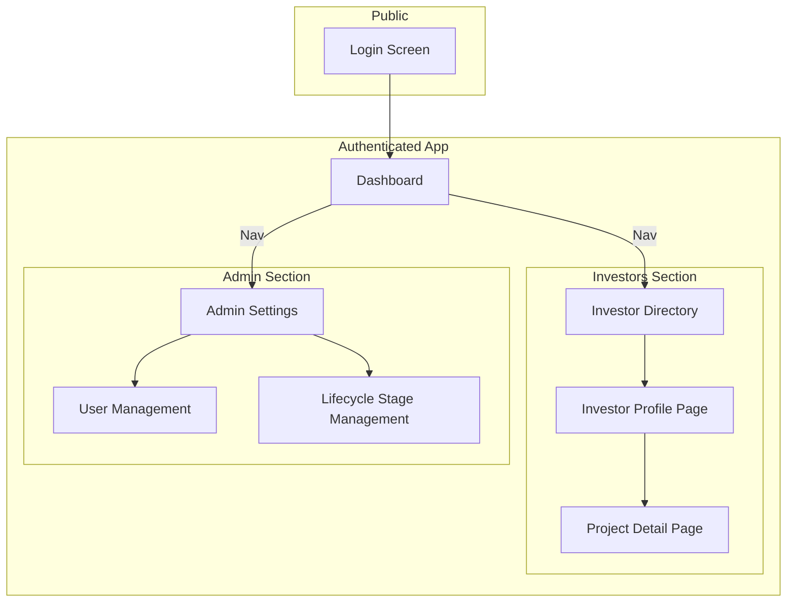
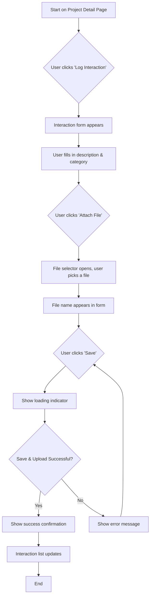

# OYSIPA Investor Tracking System & CRM UI/UX Specification

## 1. Introduction

This document defines the user experience goals, information architecture, user flows, and visual design specifications for the OYSIPA Investor Tracking System & CRM's user interface. It serves as the foundation for visual design and frontend development, ensuring a cohesive and user-centered experience.

### Overall UX Goals & Principles

#### Target User Personas
*   **OYSIPA Staff:** The primary users who perform daily tasks. They need an efficient, clear interface to manage their assigned investors and projects with minimal friction.
*   **Portal Administrator:** A trusted power-user who manages users and system settings. They need simple but powerful administrative interfaces.
*   **Director-General (DG):** An executive user who needs a high-level, at-a-glance dashboard for strategic oversight. They value data visualization and quick access to key metrics.

#### Usability Goals
*   **Efficiency:** Users should be able to complete core tasks (logging an interaction, updating a project) in the fewest steps possible.
*   **Clarity:** Information should be presented in a clear, unambiguous way. There should be no confusion about a project's status or an investor's history.
*   **Learnability:** A new staff member should be able to understand and use the system's core functionality with minimal training.

#### Design Principles
1.  **Clarity First:** The interface must be clean, professional, and easy to understand. Avoid visual clutter.
2.  **Efficiency is Key:** Design workflows to minimize clicks and data entry time.
3.  **Data-Informed:** The design should prioritize the clear presentation of data to support user tasks and decision-making.
4.  **Consistency:** Use consistent patterns and components throughout the application to create a predictable and reliable user experience.
5.  **Accessible by Default:** The application will be designed to be accessible to all users, following WCAG 2.1 AA guidelines.

### Change Log

| Date | Version | Description | Author |
| :--- | :--- | :--- | :--- |
| 2025-09-08 | 1.0 | Initial draft | Sally (UX Expert) |

## 2. Information Architecture (IA)

### Site Map / Screen Inventory

This diagram shows the overall structure and hierarchy of the application's screens.

### Navigation Structure

**Primary Navigation:**
A persistent vertical navigation sidebar on the left-hand side of the screen will be the primary method of navigation. This sidebar will be visible on all screens after login and will contain links to the top-level areas of the application. The links displayed will be role-based:
*   **All Users:** Dashboard, Investors
*   **Portal Admin / DG Only:** Admin Settings

**Secondary Navigation:**
Secondary navigation will be handled contextually within a page's content area. For example, if a settings page has multiple sections, we will use tabs at the top of the page.

**Breadcrumb Strategy:**
A breadcrumb trail will be displayed at the top of the content area on all nested pages to show the user's current location and provide easy navigation back to parent pages.
*   *Example:* `Home / Investors / [Investor Name] / [Project Name]`

## 3. User Flows

### Log a New Interaction

**User Goal:** A Staff member wants to record a support activity for a specific project and, optionally, attach a supporting document.

**Entry Points:** The "Project Detail" page.

**Success Criteria:** The new interaction, along with a link to the uploaded document, appears in the project's history list. The user receives clear confirmation that the log was saved successfully.

**Flow Diagram:**

**Edge Cases & Error Handling:**
-   The user tries to save without filling in the required description field (display a validation error).
-   The user selects a file that is too large or an unsupported file type (display an immediate validation error).
-   The network connection fails during the file upload (display a clear error message and allow the user to retry).

**Notes:**
-   The interaction form could be presented in a modal dialog to keep the user in the context of the project page they are viewing.

## 4. Wireframes & Mockups

### Primary Design Files
**Primary Design Files:** The final, high-fidelity mockups and prototypes for this project will be created and maintained in **Figma**. A link to the shared Figma project will be placed here once it is initiated.

---

### Key Screen Layouts

#### Project Detail Page

**Purpose:** To provide a comprehensive, 360-degree view of a single investment project. This screen is the central hub where staff will spend most of their time viewing history and logging new interactions.

**Key Elements (Layout Concept):**

*   **Top Bar:**
    *   Breadcrumb: `Home / Investors / [Investor Name] / [Project Name]`
    *   Main Action: `[ Update Stage ]` button

*   **Main Content Area (Two-Column Layout):**

    *   **Left Column (70% width):**
        *   **Project Header:** Contains the `Project Title` and an `[ Edit ]` button.
        *   **Project Details Card:** Displays core project information (Description, Estimated Value, Location, etc.).
        *   **Interaction History Section:**
            *   Header: "Interaction History"
            *   Action: `[ + Log New Interaction ]` button (opens a modal).
            *   List: A reverse chronological list of all logged interactions. Each item in the list shows the description, date, category, who logged it, and a link to any attached documents.

    *   **Right Column (30% width):**
        *   **Status Card:** Clearly displays the current `Lifecycle Stage`.
        *   **Investor Card:** Shows the parent `Investor Name` (linked to the Investor Profile Page).
        *   **Assigned Staff Card:** Shows the assigned `Staff Member's Name`.

**Interaction Notes:**
*   The "Log New Interaction" button will open a modal form, allowing the user to enter details without leaving the page.
*   The "Update Stage" button will open a simple dropdown or modal to change the project's lifecycle stage.

## 5. Component Library / Design System

### Design System Approach
**Design System Approach:** We will use an existing, mature design system: **Material-UI (MUI)**. We will not build a new design system from scratch.

Our approach will be to:
1.  Use the pre-built components provided by MUI as our foundation.
2.  Create a custom theme (colors, typography, spacing) to align the MUI components with our specific branding and style guide.
3.  Create thin "wrapper" components around the MUI components only when needed to enforce specific project conventions.

This approach is the most efficient way to achieve a professional, consistent, and accessible UI within the project's timeline.

---

### Core Components

Below are a few examples of the foundational MUI components we will customize and use throughout the application.

#### Button

*   **Purpose:** To allow users to trigger an action.
*   **Variants:** We will use MUI's standard variants: `contained` (for primary actions, e.g., "Save"), `outlined` (for secondary actions, e.g., "Cancel"), and `text` (for low-emphasis actions).
*   **States:** Default, Hover, Focused, Disabled.
*   **Usage Guidelines:** The choice of variant will be based on the action's importance in the user flow.

#### TextField

*   **Purpose:** To allow users to enter text in a form.
*   **Variants:** We will standardize on the `outlined` variant for all text inputs to ensure a consistent look across all forms.
*   **States:** Default, Hover, Focused, Disabled, Error.
*   **Usage Guidelines:** All text fields must have a clear, persistent label. Helper text should be used for guidance, and error text for validation feedback.

#### Card

*   **Purpose:** To group related content and actions into a single, easy-to-read container.
*   **Variants:** We will primarily use the default `elevation` variant to create clear visual hierarchy on the page.
*   **States:** N/A.
*   **Usage Guidelines:** Cards will be the primary layout element for dashboard widgets and for grouping details on pages like the "Project Detail" screen.

## 6. Branding & Style Guide

### Visual Identity
**Brand Guidelines:** As no formal brand guidelines for OYSIPA were provided, we will establish a visual identity that prioritizes professionalism, trustworthiness, and clarity. The design will be clean, modern, and conservative.

---

### Color Palette

| Color Type | Hex Code | Usage |
| :--- | :--- | :--- |
| Primary | `#1976D2` (Blue) | Primary buttons, links, active navigation items, key highlights. |
| Secondary | `#607D8B` (Blue Grey) | Secondary actions, borders, less important elements. |
| Accent | `#FFC107` (Amber) | Used sparingly for call-outs or to draw attention to a new feature. |
| Success | `#4CAF50` (Green) | Success messages, confirmation indicators. |
| Warning | `#FF9800` (Orange) | Warnings, important notices that are not errors. |
| Error | `#D32F2F` (Red) | Error messages, validation failures, destructive action confirmations. |
| Neutral | `#212121` to `#FAFAFA` | A range of greys for text, backgrounds, and borders. |

---

### Typography

#### Font Families
-   **Primary:** **Roboto**. A clean, legible, and modern sans-serif font. It is the standard font for Material Design.
-   **Monospace:** **Menlo, Courier New**. For any text that needs to be monospaced.

#### Type Scale

| Element | Size | Weight | Line Height |
| :--- | :--- | :--- | :--- |
| H1 | 2.5rem (40px) | 300 (Light) | 1.2 |
| H2 | 2rem (32px) | 400 (Regular) | 1.25 |
| H3 | 1.5rem (24px) | 400 (Regular) | 1.3 |
| Body | 1rem (16px) | 400 (Regular) | 1.5 |
| Small | 0.875rem (14px) | 400 (Regular) | 1.4 |

---

### Iconography
**Icon Library:** We will use the **Material Icons** library.
**Usage Guidelines:** Icons should be used to reinforce meaning and improve visual scanning, not as pure decoration. They must always be accompanied by a text label, except in universally understood cases (e.g., a trash can icon for delete).

---

### Spacing & Layout
**Grid System:** We will use a standard 12-column responsive grid.
**Spacing Scale:** We will adhere to MUI's standard 8px spacing unit. All margins, paddings, and gaps will be multiples of 8px (e.g., 8px, 16px, 24px) to ensure consistent and harmonious layouts.

## 7. Accessibility Requirements

### Compliance Target
**Standard:** The application will conform to the **Web Content Accessibility Guidelines (WCAG) 2.1 at Level AA**.

---

### Key Requirements

To meet our compliance target, the following requirements will be implemented:

**Visual:**
-   **Color Contrast:** All text and meaningful graphical elements will have a contrast ratio of at least 4.5:1 against their background to be readable for users with low vision.
-   **Focus Indicators:** Every interactive element (links, buttons, form fields) must have a highly visible and distinct focus indicator when navigated to via a keyboard.
-   **Text Resizing:** Users must be able to resize the text up to 200% in their browser without breaking the page layout or losing access to content.

**Interaction:**
-   **Keyboard Navigation:** All functionality, without exception, must be operable using only a keyboard. The tab order through interactive elements must be logical and predictable.
-   **Screen Reader Support:** The application will be built with semantic HTML and ARIA (Accessible Rich Internet Applications) attributes where necessary to ensure it is fully understandable and operable by users of screen readers like NVDA and VoiceOver.
-   **Touch Targets:** On mobile devices, all interactive elements will have a touch target size of at least 44x44 pixels to be easily tappable.

**Content:**
-   **Alternative Text:** All images that convey information must have descriptive alternative (`alt`) text. Decorative images will have empty alt text.
-   **Heading Structure:** All pages will use a logical and semantic heading structure (a single `<h1>`, followed by `<h2>`s, `<h3>`s, etc.) to define the page's outline.
-   **Form Labels:** Every form input will have a programmatically associated `<label>` to ensure its purpose is clear to all users.

---

### Testing Strategy
Our testing strategy will be a combination of automated and manual checks:
1.  **Automated Testing:** We will integrate an automated accessibility checker, like `axe-core`, into our development process to catch common issues early.
2.  **Manual Keyboard Testing:** We will perform regular manual tests to ensure all user flows can be completed using only the keyboard.
3.  **Manual Screen Reader Testing:** The core user journeys will be manually tested using a screen reader to verify a positive user experience.

## 8. Responsiveness Strategy

### Breakpoints

We will adopt the standard, well-tested breakpoints from the Material-UI library. This ensures our custom styles and layouts work seamlessly with our chosen component library.

| Breakpoint | Min Width | Target Devices |
| :--- | :--- | :--- |
| Mobile (xs) | 0px | Small to large mobile phones |
| Tablet (sm) | 600px | Large mobile phones, tablets in portrait mode |
| Desktop (md) | 900px | Tablets in landscape mode, small laptops |
| Wide (lg) | 1200px | Standard desktop monitors |
| Extra Wide (xl) | 1536px | Large desktop monitors |

---

### Adaptation Patterns

As the screen size changes, the layout will adapt using the following strategies:

-   **Layout Changes:** Multi-column layouts will "stack" into a single column on mobile screens. For example, the two-column layout we designed for the "Project Detail" page will become a single vertical feed on phones.

-   **Navigation Changes:** The main left-hand navigation sidebar will be permanently visible on Desktop and wider screens. On Tablet and Mobile screens, it will be hidden by default and accessible via a "hamburger" menu icon in the header to maximize screen real estate.

-   **Content Priority:** On the smallest screens, we will prioritize showing the most critical information first. Less important details or secondary actions might be collapsed into an "accordion" or moved further down the page.

-   **Interaction Changes:** Complex components like data tables will transform on mobile screens. Instead of requiring horizontal scrolling, a table will reflow into a list of cards, where each card represents a row. This provides a much better mobile experience.

## 9. Animation & Micro-interactions

### Motion Principles

1.  **Purposeful:** All animation must have a clear purpose. It should be used to guide the user's attention, provide feedback on an action, or smooth a transition between UI states. We will avoid purely decorative animations.
2.  **Subtle & Quick:** Motion should be swift and unobtrusive. Animations will typically last between 150ms and 300ms, ensuring the interface feels fast and responsive, never sluggish.
3.  **Respectful of Users:** We will fully support the `prefers-reduced-motion` accessibility feature. If a user has enabled this setting in their operating system or browser, all non-essential animations will be disabled automatically.

---

### Key Animations

Below are the primary areas where we will apply subtle animations to enhance the user experience.

-   **State Transitions:**
    -   **Description:** When new content appears or disappears (e.g., a success message after a form submission, or a modal dialog opening), it will gently fade in or out.
    -   **Duration:** ~200ms
    -   **Easing:** Ease-out

-   **Hover & Focus States:**
    -   **Description:** Interactive elements like buttons, links, and cards will have a subtle transition on their color, background, or shadow when hovered over or focused on with a keyboard.
    -   **Duration:** ~150ms
    -   **Easing:** Linear

-   **Loading Indicators:**
    -   **Description:** When data is being fetched from the backend, we will display loading indicators. This could be a spinner for actions or "skeleton" placeholders for page content, preventing layout shifts.
    -   **Duration:** N/A
    -   **Easing:** N/A

-   **Modal Dialogs:**
    -   **Description:** Modal dialogs (like the "Log Interaction" form) will fade in with a slight scale-up effect to smoothly draw the user's attention to the center of the screen.
    -   **Duration:** ~250ms
    -   **Easing:** Ease-in-out

## 10. Performance Considerations

### Performance Goals

Our goal is to create an application that feels fast and responsive. We will measure this using Google's Core Web Vitals as our benchmark.

-   **Page Load:** The main content of any page should be visible in under **2.5 seconds** (Largest Contentful Paint).
-   **Interaction Response:** When a user clicks a button or interacts with a form, the UI should respond in under **100 milliseconds** (First Input Delay).
-   **Animation FPS:** All UI animations should maintain a consistent **60 frames per second** to appear smooth and fluid.

---

### Design Strategies

To achieve these goals, we will employ the following strategies:

-   **Code Splitting:** The application will be broken into smaller code bundles. Users will only download the code necessary for the specific page they are viewing, making initial load times much faster.
-   **Lazy Loading:** Images and UI components that are not immediately visible on the screen (i.e., "below the fold") will only be loaded as the user scrolls them into view.
-   **Skeleton Screens:** When loading pages with dynamic data, like the dashboard, we will first display a "skeleton" version of the UI layout. This provides an immediate visual response and prevents the content from shifting or "jumping" as the real data arrives.
-   **Image Optimization:** All images used in the application will be compressed and served in modern, efficient formats like WebP to reduce their file size without sacrificing quality.

## 11. Next Steps

We have successfully defined the user experience goals, information architecture, user flows, and a complete style and interaction guide for the application's front end.

### Immediate Actions

1.  **Formal Approval:** This Front-End Specification should be formally approved by all stakeholders.
2.  **High-Fidelity Design:** The next step for the design process is to create the high-fidelity mockups for all screens in Figma, using this document as the definitive guide.
3.  **Developer Handoff:** This document, along with the PRD and the Architecture Document, is now ready to be handed over to the development team.

---

### Design Handoff Checklist

-   [x] All user flows documented
-   [x] Component inventory complete
-   [x] Accessibility requirements defined
-   [x] Responsive strategy clear
-   [x] Brand guidelines incorporated
-   [x] Performance goals established
